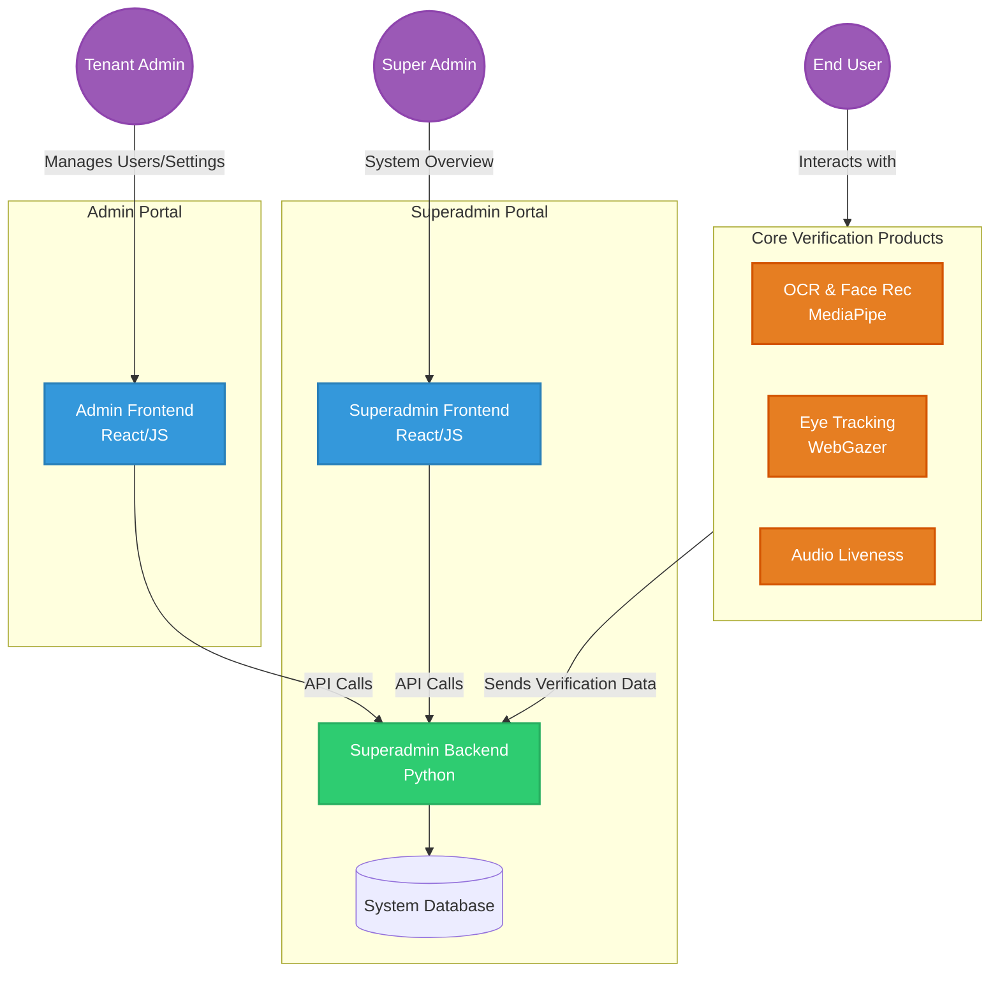

# Identity Verify MVP

An Electronic Know Your Customer (eKYC) Minimum Viable Product (MVP) focusing on identity verification using advanced biometrics, OCR, and liveness detection.

## Project Structure

This repository is organized into three main components:

1. **Superadmin Dashboard** (`/superadmin`): Contains both frontend and backend systems for overarching management of the platform and analytics.
2. **Admin Dashboard** (`/admin`): Contains the frontend interface for tenant-level administrative tasks.
3. **Products & Demos** (`/products`): Contains the core verification modules and interactive demonstrations:
    - **Audio Liveness Detection** (`demo_audio_liveness.html`)
    - **Eye Tracking for Liveness** (`demo_eye_tracking.html` using WebGazer)
    - **OCR & Face Recognition** (`demo_ocr_face.html` using MediaPipe)

## Architecture

The system follows a modular architecture separating the core verification products from the administrative dashboards.

## Technologies Used

- **Frontend**: JavaScript, HTML, CSS (React likely used in admin/superadmin based on App.js)
- **Backend**: Python (Superadmin backend)
- **Biometrics & Vision**: 
  - MediaPipe for Face Mesh and Vision tasks
  - WebGazer for Eye Tracking
  - Audio processing for Liveness

## Getting Started

*(Instructions on how to run each module will be added here. Typically involves starting a Python backend server and serving the frontend assets.)*
